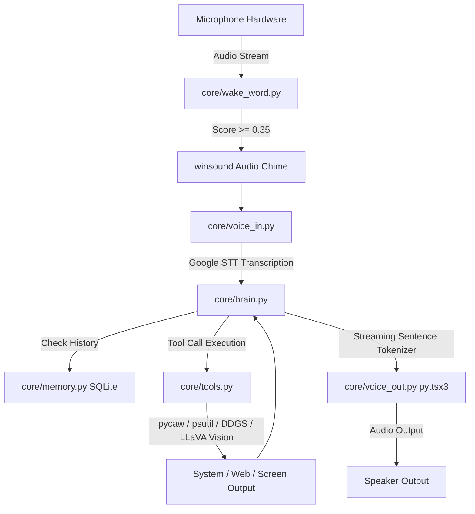

# ⚡ JAVI — Just Another Voice Interface

**JAVI** is a high-performance, low-latency, privacy-focused desktop AI voice assistant for Windows. Designed as a localized, autonomous assistant, JAVI combines real-time **OpenWakeWord** trigger spotting, **Local LLM reasoning via Ollama (`qwen2.5:3b`)**, **multimodal screen vision (`llava:7b`)**, **SQLite conversation & fact memory**, and **Windows system integration** (volume control, media playback, application launching, system diagnostics, and DuckDuckGo web search).

---

## 🌟 Key Features

- **⚡ Zero-Latency Passive Wake Word Detection**: Powered by OpenWakeWord's ONNX runtime (`hey_jarvis` model) using async hardware audio streaming with minimal CPU footprint.
- **🧠 Local Intelligence with Streaming Sentence Handoff**: Driven by Ollama (`qwen2.5:3b`). LLM outputs are parsed into complete sentences on-the-fly via regex sentence boundaries and fed directly to the Speech Synthesis engine for instant voice responses.
- **👁️ Multimodal Screen Analysis**: Real-time monitor capture analyzed locally via `llava:7b` vision model to answer questions about what is on screen.
- **🛠️ Native Windows Tool Execution**: Automates system volume control (`pycaw`), media playback keys (`user32.dll`), application launching (`start`), live web search (`DuckDuckGo`), and system telemetry (`psutil`).
- **💾 Persistent Memory**: SQLite database (`javi_memory.db`) storing full dialogue history and user facts across restarts.
- **🔊 Robust Speech Synthesis**: Built on SAPI5 (`pyttsx3`) with per-utterance engine instantiation to eliminate Windows COM event loop freezing.
- **🖥️ System Tray Daemon**: Runs silently in the taskbar with a dynamic custom-drawn 64x64 blue orb icon (`pystray`), mute toggle, and background worker threads.

---

## 🏗️ Architecture & Pipeline Flow



### Turn Lifecycle
1. **Passive Monitoring**: `WakeWordDetector` listens asynchronously via `sounddevice` callback on low-CPU budget.
2. **Audio Handoff**: Upon trigger (`hey_jarvis`), a 1000Hz acknowledgement chime sounds.
3. **Speech-to-Text**: `VoiceInput` captures 5 seconds of audio, validates volume threshold (> 400 peak amplitude), and transcribes via Google STT.
4. **Brain & Function Calling**: `JarvisBrain` feeds input + SQLite history to Ollama `qwen2.5:3b`. If a tool call is generated, `core/tools.py` executes the function and returns JSON to the model.
5. **Real-Time Streaming TTS**: LLM stream chunks are accumulated into full sentences and immediately spoken via SAPI5 `VoiceOutput`.

---

## 📁 Repository Structure

```
javi/
├── core/
│   ├── __init__.py          # Package declaration
│   ├── brain.py             # Ollama LLM integration, function calling, streaming tokenizer
│   ├── memory.py            # SQLite database manager for dialogue history and facts
│   ├── tools.py             # Hardware, web, screen vision, and application control tools
│   ├── voice_in.py          # SoundDevice audio capture & SpeechRecognition STT engine
│   ├── voice_out.py         # SAPI5 pyttsx3 TTS engine with fresh COM lifecycle
│   └── wake_word.py         # OpenWakeWord ONNX wake engine with async audio queue
├── tests/
│   └── test_tools.py        # Unit test suite for system tools & app launching
├── debug_wake.py            # Live CLI wake word detector & confidence bar monitor
├── javi_memory.db           # SQLite persistent storage database
├── launch_javi_silent.vbs   # Silent background VBScript runner for Windows taskbar daemon
├── main.py                  # Terminal interactive CLI engine entrypoint
├── requirements.txt         # Project dependencies specification
├── test_handoff.py          # Timing & handoff integration validator
├── test_input_pipeline.py   # Full wake -> STT integration validator
├── test_mic.py              # Microphone hardware input & volume checker
├── test_speaker.py          # Multi-utterance TTS COM event loop validator
├── test_voice.py            # Standalone voice input validator
└── tray_app.py              # Windows System Tray desktop application daemon
```

---

## 🔍 Exhaustive File-by-File & Line-by-Line Technical Analysis

---

### 1. `main.py` (CLI Interactive Entrypoint)

**File Path:** [main.py](file:///c:/Users/JEEVAN%20NAG%20N/OneDrive/Desktop/javi/main.py)  
**Description:** The primary command-line execution runner for JAVI. Manages the main event loop, initializing all core subsystems and orchestrating the wake-word -> audio chime -> STT -> LLM stream -> TTS pipeline.

```python
1: import sys
2: import time
3: import winsound
4: from core.brain import JarvisBrain
5: from core.voice_out import VoiceOutput
6: from core.voice_in import VoiceInput
7: from core.wake_word import WakeWordDetector
```
- **Lines 1–7**: Imports Python standard modules (`sys` for exit control, `time` for delays, `winsound` for hardware audio feedback) and imports core JAVI module components (`JarvisBrain`, `VoiceOutput`, `VoiceInput`, `WakeWordDetector`).

```python
9: def play_chime():
10:     """Short non-blocking acknowledgement tone."""
11:     winsound.Beep(1000, 150)
```
- **Lines 9–11**: `play_chime()` triggers a 1000 Hz tone for 150 milliseconds via Windows kernel `winsound.Beep` to provide immediate auditory confirmation when the wake word is spotted.

```python
13: def run():
14:     print("=" * 65)
15:     print("  JAVI // STREAMING LOW-LATENCY RUNTIME ONLINE")
16:     print("  Trigger: 'Hey Jarvis' | Model: Ollama (qwen2.5:3b)")
17:     print("  Say 'shutdown', 'power down', or 'exit' to stop.")
18:     print("=" * 65 + "\n")
```
- **Lines 13–18**: `run()` function initializes terminal banner output announcing runtime parameters and shutdown triggers.

```python
20:     speaker = VoiceOutput(rate=195)
21:     ear = VoiceInput(device_index=1)
22:     javi = JarvisBrain()
23:     wake_engine = WakeWordDetector(target_word="hey_jarvis", threshold=0.35, device_index=1)
```
- **Lines 20–23**: Subsystem instantiation:
  - `VoiceOutput(rate=195)`: Sets text-to-speech rate to 195 words per minute.
  - `VoiceInput(device_index=1)`: Binds speech input to audio recording hardware index 1.
  - `JarvisBrain()`: Instantiates Ollama model orchestrator and SQLite memory.
  - `WakeWordDetector(...)`: Configures OpenWakeWord ONNX model for `hey_jarvis` at a confidence threshold of 0.35 on device index 1.

```python
25:     boot_line = "Streaming pipeline online. Standing by, Commander."
26:     print(f"JAVI: {boot_line}\n")
27:     speaker.speak(boot_line)
```
- **Lines 25–27**: Announces system readiness both visually in stdout and audibly via TTS.

```python
29:     while True:
30:         try:
31:             # 1. Passive Standby: Low-CPU callback listener
32:             wake_engine.wait_for_wake_word()
```
- **Lines 29–32**: Enters main operational loop. `wake_engine.wait_for_wake_word()` blocks in low-CPU standby state until ONNX score crosses the 0.35 threshold.

```python
34:             # 2. Hardware-safe audio ping
35:             play_chime()
36: 
37:             # 3. Active Command Capture
38:             user_command = ear.listen(duration=5)
39: 
40:             if not user_command:
41:                 print("[Standby] No command detected. Resuming standby mode.\n")
42:                 continue
```
- **Lines 34–42**: Upon wake word trigger, plays chime, records audio for up to 5 seconds, and transcribes it. If transcription is empty or silent, logs warning and returns to standby.

```python
44:             print(f"\nYou > {user_command}\nJAVI: ", end="", flush=True)
45: 
46:             # 4. Check for shutdown commands
47:             if any(term in user_command.lower() for term in ["shutdown", "power down", "exit", "quit"]):
48:                 farewell = "Disengaging vocal and operational arrays. Standing by."
49:                 print(farewell)
50:                 speaker.speak(farewell)
51:                 break
```
- **Lines 44–51**: Prints transcribed command. Scans user command for termination keywords (`shutdown`, `power down`, `exit`, `quit`). If detected, speaks farewell and breaks execution loop.

```python
53:             # 5. Stream sentences into speaker in real time
54:             for sentence in javi.chat_stream(user_command):
55:                 print(f"{sentence} ", end="", flush=True)
56:                 speaker.speak(sentence)
57: 
58:             print("\n")
59:             time.sleep(0.5)
```
- **Lines 53–59**: Streams generated sentences from `javi.chat_stream()`. Each complete sentence is printed to console and spoken aloud immediately via `speaker.speak()`.

```python
61:         except KeyboardInterrupt:
62:             print("\nJAVI: Core halted via manual override.")
63:             sys.exit(0)
64: 
65: if __name__ == "__main__":
66:     run()
```
- **Lines 61–66**: Catches `Ctrl+C` keyboard interrupts for graceful exit and guards script execution under standard `__main__` entrypoint.

---

### 2. `tray_app.py` (Windows System Tray Daemon)

**File Path:** [tray_app.py](file:///c:/Users/JEEVAN%20NAG%20N/OneDrive/Desktop/javi/tray_app.py)  
**Description:** Runs JAVI as a silent background daemon living in the Windows notification area (System Tray). Displays a dynamic blue orb icon using `pystray` and Pillow, and controls background worker threads.

```python
1: import sys
2: import threading
3: import time
4: import winsound
5: from PIL import Image, ImageDraw
6: import pystray
7: from pystray import MenuItem as item
8: 
9: from core.brain import JarvisBrain
10: from core.voice_out import VoiceOutput
11: from core.voice_in import VoiceInput
12: from core.wake_word import WakeWordDetector
```
- **Lines 1–12**: Imports threading, standard libraries, Pillow image rendering modules, `pystray` taskbar menu components, and core JAVI subsystems.

```python
14: class JaviTrayApp:
15:     def __init__(self):
16:         self.running = True
17:         self.is_muted = False
18:         self.speaker = VoiceOutput(rate=195)
19:         self.ear = VoiceInput(device_index=1)
20:         self.javi = JarvisBrain()
21:         self.wake_engine = WakeWordDetector(target_word="hey_jarvis", threshold=0.35, device_index=1)
22:         self.icon = None
```
- **Lines 14–22**: `JaviTrayApp` class constructor initializing daemon flags (`running`, `is_muted`), instantiating speech hardware interfaces, brain instance, wake engine, and icon handle.

```python
24:     def _create_tray_icon(self):
25:         """Generates a dynamic 64x64 blue orb icon for the Windows taskbar tray."""
26:         width, height = 64, 64
27:         image = Image.new("RGBA", (width, height), (0, 0, 0, 0))
28:         draw = ImageDraw.Draw(image)
29:         # Outer ring
30:         draw.ellipse((4, 4, 60, 60), fill=(20, 30, 45), outline=(0, 210, 255), width=3)
31:         # Inner glowing core
32:         draw.ellipse((18, 18, 46, 46), fill=(0, 180, 255))
33:         return image
```
- **Lines 24–33**: Synthesizes a custom 64x64 RGBA icon in memory: an outer dark slate circle with a cyan outline (`#00D2FF`) and a solid glowing cyan center core (`#00B4FF`).

```python
35:     def listener_thread(self):
36:         """Persistent background thread for wake-word spotting and command execution."""
37:         print("[JAVI Tray] Background engine active.")
38:         self.speaker.speak("JAVI background runtime active.")
39: 
40:         while self.running:
41:             try:
42:                 # 1. Background Wake Word Listening
43:                 detected = self.wake_engine.wait_for_wake_word()
44:                 if not self.running:
45:                     break
46: 
47:                 if self.is_muted:
48:                     continue
```
- **Lines 35–48**: Defines the worker thread function. Runs in a loop while `self.running` is true. Waits for wake word spotting. If muted, skips processing and resumes standby.

```python
50:                 # 2. Audio Beep
51:                 winsound.Beep(1000, 150)
52: 
53:                 # 3. Command Capture
54:                 command = self.ear.listen(duration=5)
55:                 if not command:
56:                     print("[Tray Standby] No audible command recognized.")
57:                     continue
58: 
59:                 print(f"\nYou > {command}\nJAVI: ", end="", flush=True)
```
- **Lines 50–59**: Emits audio chime upon wake detection, captures user voice input for 5 seconds, and handles silence gracefully.

```python
61:                 if any(w in command.lower() for w in ["shutdown", "exit", "quit", "power down"]):
62:                     farewell = "Disengaging system. Standing by."
63:                     print(farewell)
64:                     self.speaker.speak(farewell)
65:                     self.stop_app()
66:                     break
```
- **Lines 61–66**: Checks for voice shutdown requests in tray mode and calls `self.stop_app()` to cleanly terminate tray app and background worker.

```python
68:                 # 4. Stream response from LLM + SQLite memory
69:                 for sentence in self.javi.chat_stream(command):
70:                     print(f"{sentence} ", end="", flush=True)
71:                     self.speaker.speak(sentence)
72: 
73:                 print("\n")
74:                 time.sleep(0.5)
75: 
76:             except Exception as e:
77:                 print(f"[Tray Loop Error] {e}")
78:                 time.sleep(1)
```
- **Lines 68–79**: Streams LLM output into audio TTS in real-time, catching exceptions to ensure daemon stability.

```python
80:     def toggle_mute(self, icon, item):
81:         self.is_muted = not self.is_muted
82:         status = "Muted" if self.is_muted else "Unmuted"
83:         print(f"[Tray Action] JAVI is now {status}.")
84: 
85:     def stop_app(self, icon=None, item=None):
86:         print("[Tray Action] Shutting down JAVI cleanly...")
87:         self.running = False
88:         if self.icon:
89:             self.icon.stop()
90:         sys.exit(0)
```
- **Lines 80–90**: Callbacks for context menu options: `toggle_mute` flips voice processing state, and `stop_app` stops tray icon event loop and exits Python process.

```python
92:     def run(self):
93:         # Run the voice listener in a background worker thread
94:         t = threading.Thread(target=self.listener_thread, daemon=True)
95:         t.start()
96: 
97:         menu = (
98:             item('Mute / Unmute', self.toggle_mute),
99:             item('Exit JAVI', self.stop_app),
100:         )
101: 
102:         image = self._createtray_icon()
103:         self.icon = pystray.Icon("JAVI", image, "JAVI Assistant", menu)
104:         self.icon.run()
105: 
106: if __name__ == "__main__":
107:     app = JaviTrayApp()
108:     app.run()
```
- **Lines 92–108**: Spawns background daemon thread for audio pipeline, attaches right-click context menu to taskbar icon (`Mute / Unmute`, `Exit JAVI`), and enters main `pystray` GUI loop.

---

### 3. `launch_javi_silent.vbs` (Silent Windows VBScript Launcher)

**File Path:** [launch_javi_silent.vbs](file:///c:/Users/JEEVAN%20NAG%20N/OneDrive/Desktop/javi/launch_javi_silent.vbs)  
**Description:** Windows Script Host VBScript runner to launch `tray_app.py` completely hidden in the background without creating a visible CMD command prompt window.

```vbscript
1: Set WshShell = CreateObject("WScript.Shell")
2: ' Run pythonw tray_app.py with 0 (hidden window mode)
3: WshShell.Run "pythonw tray_app.py", 0, False
4: Set WshShell = Nothing
```
- **Line 1**: Instantiates `WScript.Shell` COM object.
- **Line 3**: Executes `pythonw tray_app.py`. The second parameter `0` sets the window state to hidden (`SW_HIDE`), and `False` runs the process asynchronously without waiting for completion.
- **Line 4**: Releases COM shell object reference.

---

### 4. `core/wake_word.py` (ONNX Wake Word Engine)

**File Path:** [core/wake_word.py](file:///c:/Users/JEEVAN%20NAG%20N/OneDrive/Desktop/javi/core/wake_word.py)  
**Description:** Low-latency ONNX-powered wake word engine using `openwakeword` and `sounddevice` asynchronous thread callbacks.

```python
1: import queue
2: import time
3: import numpy as np
4: import sounddevice as sd
5: from openwakeword.model import Model
```
- **Lines 1–5**: Imports queue management, sound device streaming, NumPy, and OpenWakeWord ONNX inference runner.

```python
7: class WakeWordDetector:
8:     def __init__(self, target_word: str = "hey_jarvis", threshold: float = 0.35, device_index: int = 1):
9:         self.sample_rate = 16000
10:         self.chunk_size = 1280  # 80ms frames
11:         self.target_word = target_word
12:         self.threshold = threshold
13:         self.device_index = device_index
14:         self.audio_queue = queue.Queue()
15: 
16:         print(f"[WakeWord] Loading ONNX model on Mic Index {self.device_index}...")
17:         self.model = Model(wakeword_models=[self.target_word], inference_framework="onnx")
```
- **Lines 7–17**: Constructor parameters:
  - `sample_rate`: 16 kHz mono audio required by OpenWakeWord model.
  - `chunk_size`: 1280 samples = exactly 80ms frame buffer size.
  - `audio_queue`: Thread-safe queue for inter-thread audio frame passing.
  - `Model(...)`: Loads pre-trained ONNX neural network model for target wake model (`hey_jarvis`).

```python
19:     def _audio_callback(self, indata, frames, time_info, status):
20:         """Asynchronous audio callback running on hardware audio thread."""
21:         self.audio_queue.put(indata.copy())
```
- **Lines 19–21**: Asynchronous hardware audio callback invoked directly by PortAudio/SoundDevice low-level driver. Enqueues copy of audio slice.

```python
23:     def wait_for_wake_word(self) -> bool:
24:         """Listens using an async callback and releases mic immediately on trigger."""
25:         print(f"\n[Standby] Say 'Hey Jarvis' to wake...")
26:         self.model.reset()
27: 
28:         # Clear any stale frames from queue
29:         while not self.audio_queue.empty():
30:             try:
31:                 self.audio_queue.get_nowait()
32:             except queue.Empty:
33:                 break
```
- **Lines 23–33**: Resets internal neural network state buffers and clears residual queue frames to prevent false positive triggers from old audio.

```python
36:         with sd.InputStream(
37:             samplerate=self.sample_rate,
38:             channels=1,
39:             dtype='int16',
40:             blocksize=self.chunk_size,
41:             device=self.device_index,
42:             callback=self._audio_callback
43:         ):
44:             while True:
45:                 try:
46:                     # Non-blocking pull with 1-second timeout
47:                     audio_frame = self.audio_queue.get(timeout=1.0)
48:                 except queue.Empty:
49:                     continue
50: 
51:                 audio_data = audio_frame.flatten()
52:                 prediction = self.model.predict(audio_data)
53:                 score = prediction.get(self.target_word, 0.0)
54: 
55:                 if score >= self.threshold:
56:                     print(f"\n[Triggered] Wake word detected! (Confidence: {score:.2f})")
57:                     return True
```
- **Lines 36–57**: Context manager opens audio input stream. In main loop, pulls 80ms frames, flattens array, runs ONNX `predict()`, checks prediction score against threshold (0.35), and returns `True` immediately upon detection, automatically closing microphone stream.

---

### 5. `core/voice_in.py` (Audio Recorder & Speech-to-Text)

**File Path:** [core/voice_in.py](file:///c:/Users/JEEVAN%20NAG%20N/OneDrive/Desktop/javi/core/voice_in.py)  
**Description:** Handles microphone audio capture, volume amplitude gate verification, and Speech-To-Text (STT) transcription via Google Speech Recognition API.

```python
1: import io
2: import time
3: import numpy as np
4: import sounddevice as sd
5: from scipy.io import wavfile
6: import speech_recognition as sr
```
- **Lines 1–6**: Imports standard IO buffers, time, NumPy, SoundDevice, SciPy WAV file writer, and `speech_recognition`.

```python
8: class VoiceInput:
9:     def __init__(self, sample_rate: int = 16000, device_index: int = 1):
10:         self.sample_rate = sample_rate
11:         self.device_index = device_index
12:         self.recognizer = sr.Recognizer()
13:         self.recognizer.energy_threshold = 200
14:         self.recognizer.dynamic_energy_threshold = False
```
- **Lines 8–14**: Constructor sets sample rate (16 kHz), device index (1), initializes `sr.Recognizer()`, locks energy threshold at static value 200 to prevent ambient noise gain drift.

```python
16:     def calibrate(self):
17:         try:
18:             device_info = sd.query_devices(self.device_index)
19:             print(f"[Audio In] Bound to: {device_info['name']}")
20:         except Exception as e:
21:             print(f"[Audio Warning] {e}")
```
- **Lines 16–21**: Validates bound hardware microphone index and prints soundcard hardware device name.

```python
23:     def listen(self, duration: int = 5) -> str:
24:         """Records from AMD mic, verifies volume, and transcribes."""
25:         time.sleep(0.15)
26:         print(f"\n[Listening] Speak your command now ({duration}s)...")
27:         try:
28:             audio_array = sd.rec(
29:                 int(duration * self.sample_rate),
30:                 samplerate=self.sample_rate,
31:                 channels=1,
32:                 dtype='int16',
33:                 device=self.device_index
34:             )
35:             sd.wait()
```
- **Lines 23–35**: Pauses 150ms to allow audio line settling, triggers blocking recording for specified duration (`duration=5` seconds) using `sd.rec()`, and waits for buffer fill via `sd.wait()`.

```python
37:             max_vol = np.max(np.abs(audio_array))
38:             if max_vol < 400:
39:                 return ""
```
- **Lines 37–39**: Hardware Volume Gate: Calculates peak amplitude (`max_vol`). If peak amplitude is under 400 (background silence or muted mic), discards frame and returns empty string instantly to save API calls.

```python
41:             wav_buffer = io.BytesIO()
42:             wavfile.write(wav_buffer, self.sample_rate, audio_array)
43:             wav_buffer.seek(0)
44: 
45:             with sr.AudioFile(wav_buffer) as source:
46:                 audio_data = self.recognizer.record(source)
47:                 text = self.recognizer.recognize_google(audio_data)
48:                 return text.strip()
49: 
50:         except sr.UnknownValueError:
51:             return ""
52:         except Exception as e:
53:             print(f"[STT Error] {e}")
54:             return ""
```
- **Lines 41–54**: Encodes raw int16 PCM array into standard WAV format inside an in-memory `io.BytesIO` byte buffer, loads buffer via `sr.AudioFile`, transcribes using Google STT API, handles unrecognized speech or network errors safely.

---

### 6. `core/voice_out.py` (Text-to-Speech Engine)

**File Path:** [core/voice_out.py](file:///c:/Users/JEEVAN%20NAG%20N/OneDrive/Desktop/javi/core/voice_out.py)  
**Description:** Manages Windows SAPI5 Speech Synthesis (`pyttsx3`) with isolated COM object instantiation per speech request.

```python
1: import pyttsx3
2: 
3: class VoiceOutput:
4:     def __init__(self, rate: int = 195):
5:         self.rate = rate
```
- **Lines 1–5**: Constructor accepting speech rate parameter (default 195 WPM).

```python
7:     def speak(self, text: str):
8:         """
9:         Initializes a fresh SAPI5 engine instance per call to prevent
10:         the Windows COM event loop from freezing on subsequent turns.
11:         """
12:         if not text:
13:             return
14:         try:
15:             engine = pyttsx3.init()
16:             engine.setProperty('rate', self.rate)
17:             
18:             # Select system default voice
19:             voices = engine.getProperty('voices')
20:             if voices:
21:                 engine.setProperty('voice', voices[0].id)
22: 
23:             engine.say(text)
24:             engine.runAndWait()
25:             engine.stop()
26:         except Exception as e:
27:             print(f"[Speech Synthesis Error] {e}")
```
- **Lines 7–27**: Architectural Safeguard: Initializes a fresh `pyttsx3.init()` engine on every invocation. Reusing a single `pyttsx3` engine instance across multiple turns on Windows causes the SAPI5 COM message pump to deadlock. Instantiating fresh, setting properties, executing `runAndWait()`, and calling `engine.stop()` guarantees 100% reliable speech across infinite conversation turns.

---

### 7. `core/memory.py` (SQLite Memory Manager)

**File Path:** [core/memory.py](file:///c:/Users/JEEVAN%20NAG%20N/OneDrive/Desktop/javi/core/memory.py)  
**Description:** Persistent storage database layer using SQLite3 (`javi_memory.db`) to record conversation logs and long-term key/value user facts.

```python
1: import sqlite3
2: import os
3: from typing import List, Dict
4: 
5: DB_PATH = os.path.join(os.path.dirname(__file__), "..", "javi_memory.db")
```
- **Lines 1–5**: Constructs absolute file path to `javi_memory.db` in project root directory.

```python
7: class JarvisMemory:
8:     def __init__(self, db_path: str = DB_PATH):
9:         self.db_path = db_path
10:         self._init_db()
11: 
12:     def _init_db(self):
13:         """Initializes tables for conversation logs and key-value memory."""
14:         with sqlite3.connect(self.db_path) as conn:
15:             cursor = conn.cursor()
16:             # Table for conversation history
17:             cursor.execute("""
18:                 CREATE TABLE IF NOT EXISTS conversation_history (
19:                     id INTEGER PRIMARY KEY AUTOINCREMENT,
20:                     timestamp DATETIME DEFAULT CURRENT_TIMESTAMP,
21:                     role TEXT NOT NULL,
22:                     content TEXT NOT NULL
23:                 )
24:             """)
25:             # Table for explicit facts / settings
26:             cursor.execute("""
27:                 CREATE TABLE IF NOT EXISTS user_facts (
28:                     key TEXT PRIMARY KEY,
29:                     value TEXT NOT NULL,
30:                     updated_at DATETIME DEFAULT CURRENT_TIMESTAMP
31:                 )
32:             """)
33:             conn.commit()
```
- **Lines 7–33**: Connects to SQLite database and ensures schema initialization:
  - `conversation_history`: Stores message turn ID, timestamp, role (`user`/`assistant`/`tool`), and string content.
  - `user_facts`: Key-value table for persistent user preferences or facts.

```python
35:     def save_message(self, role: str, content: str):
36:         """Persists a message in the conversation log."""
37:         with sqlite3.connect(self.db_path) as conn:
38:             cursor = conn.cursor()
39:             cursor.execute(
40:                 "INSERT INTO conversation_history (role, content) VALUES (?, ?)",
41:                 (role, content)
42:             )
43:             conn.commit()
```
- **Lines 35–43**: Inserts a new chat turn into SQLite database.

```python
45:     def get_recent_history(self, limit: int = 6) -> List[Dict[str, str]]:
46:         """Retrieves the most recent dialogue turns to prime the LLM context."""
47:         with sqlite3.connect(self.db_path) as conn:
48:             cursor = conn.cursor()
49:             cursor.execute(
50:                 "SELECT role, content FROM conversation_history ORDER BY id DESC LIMIT ?",
51:                 (limit,)
52:             )
53:             rows = cursor.fetchall()
54:             # Reverse so it's in chronological order
55:             return [{"role": r[0], "content": r[1]} for r in reversed(rows)]
```
- **Lines 45–56**: Queries the last N (default 6) dialogue turns, reversing the fetched list so items are ordered chronologically for LLM prompt insertion.

```python
57:     def set_fact(self, key: str, value: str):
58:         """Stores or updates a long-term key/value fact."""
59:         with sqlite3.connect(self.db_path) as conn:
60:             cursor = conn.cursor()
61:             cursor.execute(
62:                 "INSERT OR REPLACE INTO user_facts (key, value, updated_at) VALUES (?, ?, CURRENT_TIMESTAMP)",
63:                 (key, value)
64:             )
65:             conn.commit()
66: 
67:     def get_all_facts(self) -> Dict[str, str]:
68:         """Loads all long-term stored facts."""
69:         with sqlite3.connect(self.db_path) as conn:
70:             cursor = conn.cursor()
71:             cursor.execute("SELECT key, value FROM user_facts")
72:             return dict(cursor.fetchall())
```
- **Lines 57–72**: Provides key/value setter (`INSERT OR REPLACE`) and getter (`SELECT key, value`) methods for long-term fact storage.

---

### 8. `core/tools.py` (System Tools & Hardware Control)

**File Path:** [core/tools.py](file:///c:/Users/JEEVAN%20NAG%20N/OneDrive/Desktop/javi/core/tools.py)  
**Description:** Defines native executable tools exposed to the Ollama LLM, including volume control, media keys, psutil system telemetry, application launcher, DuckDuckGo web search, and PIL + LLaVA multimodal screen vision.

```python
1: import os
2: import io
3: import base64
4: import ctypes
5: import datetime
6: import psutil
7: from typing import Dict, Any
8: from PIL import ImageGrab
9: import ollama
10: from duckduckgo_search import DDGS
11: from comtypes import CLSCTX_ALL
12: from pycaw.pycaw import AudioUtilities, IAudioEndpointVolume
```
- **Lines 1–12**: Imports system libraries, image capture, Ollama SDK, DuckDuckGo search API, and Windows audio endpoint COM bindings (`pycaw`).

```python
15: VK_MEDIA_NEXT_TRACK = 0xB0
16: VK_MEDIA_PREV_TRACK = 0xB1
17: VK_MEDIA_STOP       = 0xB2
18: VK_MEDIA_PLAY_PAUSE = 0xB3
19: KEYEVENTF_EXTENDEDKEY = 0x0001
20: KEYEVENTF_KEYUP       = 0x0002
```
- **Lines 15–20**: Constants mapping to Windows Virtual-Key (VK) codes for multimedia hardware control.

```python
22: def _get_volume_endpoint():
23:     devices = AudioUtilities.GetSpeakers()
24:     interface = devices.Activate(IAudioEndpointVolume._iid_, CLSCTX_ALL, None)
25:     return interface.QueryInterface(IAudioEndpointVolume)
26: 
27: def set_system_volume(level: int) -> Dict[str, Any]:
28:     try:
29:         volume = _get_volume_endpoint()
30:         clamped_level = max(0, min(100, int(level)))
31:         volume.SetMasterVolumeLevelScalar(clamped_level / 100.0, None)
32:         return {"status": "success", "message": f"Master volume set to {clamped_level}%"}
33:     except Exception as exc:
34:         return {"status": "error", "message": f"Failed to set volume: {str(exc)}"}
35: 
36: def toggle_mute() -> Dict[str, Any]:
37:     try:
38:         volume = _get_volume_endpoint()
39:         current_mute = volume.GetMute()
40:         new_state = not current_mute
41:         volume.SetMute(new_state, None)
42:         state_str = "muted" if new_state else "unmuted"
43:         return {"status": "success", "message": f"Audio is now {state_str}"}
44:     except Exception as exc:
45:         return {"status": "error", "message": f"Failed to toggle mute: {str(exc)}"}
```
- **Lines 22–45**: System Volume Control: Uses `pycaw` COM interface to programmatically get active audio endpoint speakers, set master scalar volume (0 to 100%), and toggle mute state.

```python
47: def control_media(action: str) -> Dict[str, Any]:
48:     action_clean = action.strip().lower()
49:     key_map = {
50:         "play_pause": VK_MEDIA_PLAY_PAUSE,
51:         "play": VK_MEDIA_PLAY_PAUSE,
52:         "pause": VK_MEDIA_PLAY_PAUSE,
53:         "next": VK_MEDIA_NEXT_TRACK,
54:         "previous": VK_MEDIA_PREV_TRACK,
55:         "prev": VK_MEDIA_PREV_TRACK,
56:         "stop": VK_MEDIA_STOP,
57:     }
58: 
59:     if action_clean not in key_map:
60:         return {"status": "error", "message": f"Unsupported action: {action}"}
61: 
62:     vk_code = key_map[action_clean]
63:     ctypes.windll.user32.keybd_event(vk_code, 0, KEYEVENTF_EXTENDEDKEY, 0)
64:     ctypes.windll.user32.keybd_event(vk_code, 0, KEYEVENTF_EXTENDEDKEY | KEYEVENTF_KEYUP, 0)
65:     return {"status": "success", "message": f"Executed media command: {action_clean}"}
```
- **Lines 47–65**: Multimedia Control: Calls Windows API `keybd_event` via `ctypes.windll.user32` to synthesize hardware key press and key release events for play/pause, next track, previous track, and stop.

```python
67: def get_system_diagnostics() -> Dict[str, Any]:
68:     cpu_percent = psutil.cpu_percent(interval=0.2)
69:     virtual_mem = psutil.virtual_memory()
70:     battery = psutil.sensors_battery()
71: 
72:     battery_info = "Desktop (AC Power)"
73:     if battery is not None:
74:         battery_info = f"{battery.percent}% {'(Charging)' if battery.power_plugged else '(Discharging)'}"
75: 
76:     return {
77:         "status": "success",
78:         "cpu_usage": f"{cpu_percent}%",
79:         "ram_usage": f"{virtual_mem.percent}% ({round(virtual_mem.used / (1024**3), 2)} GB / {round(virtual_mem.total / (1024**3), 2)} GB)",
80:         "battery": battery_info,
81:     }
```
- **Lines 67–81**: System Telemetry: Leverages `psutil` to sample real-time CPU percentage over 200ms window, RAM utilization in GB, and battery charge percentage/charging state.

```python
83: def launch_application(app_name: str) -> Dict[str, str]:
84:     clean_name = app_name.strip().lower()
85:     try:
86:         os.system(f"start {clean_name}")
87:         return {"status": "success", "message": f"Launched {clean_name}"}
88:     except Exception as exc:
89:         return {"status": "error", "message": f"Failed to open {clean_name}: {str(exc)}"}
```
- **Lines 83–90**: Application Launcher: Invokes Windows `start` command to launch desktop programs (e.g. `chrome`, `calc`, `notepad`, `mspaint`).

```python
91: def search_web(query: str) -> Dict[str, Any]:
92:     try:
93:         with DDGS() as ddgs:
94:             results = list(ddgs.text(query, max_results=3))
95:             if not results:
96:                 return {"status": "empty", "message": "No search results found."}
97:             snippets = [f"{r['title']}: {r['body']}" for r in results]
98:             return {"status": "success", "results": " | ".join(snippets)}
99:     except Exception as exc:
100:         return {"status": "error", "message": f"Web search failed: {str(exc)}"}
```
- **Lines 91–100**: Live Web Search: Performs search queries via DuckDuckGo (`DDGS`), gathering top 3 text search snippets into a single pipeline output string.

```python
102: def get_daily_briefing() -> Dict[str, Any]:
103:     """Generates an executive daily briefing with local time, date, weather snapshot, and battery level."""
104:     now = datetime.datetime.now()
105:     date_str = now.strftime("%A, %B %d, %Y")
106:     time_str = now.strftime("%I:%M %p")
107: 
108:     # System vitals
109:     battery = psutil.sensors_battery()
110:     bat_str = f"{battery.percent}%" if battery else "AC Power"
111: 
112:     # Quick weather lookup
113:     weather_summary = "Weather data unavailable"
114:     try:
115:         with DDGS() as ddgs:
116:             res = list(ddgs.text("current local weather today temperature conditions", max_results=1))
117:             if res:
118:                 weather_summary = res[0]['body']
119:     except Exception:
120:         pass
121: 
122:     return {
123:         "status": "success",
124:         "date": date_str,
125:         "time": time_str,
126:         "battery": bat_str,
127:         "weather_snapshot": weather_summary
128:     }
```
- **Lines 102–128**: Executive Daily Briefing: Compiles current date, time, battery level, and live DuckDuckGo weather report into a unified JSON telemetry dictionary.

```python
130: def analyze_screen(prompt: str = "Describe and analyze what is on this screen in 1 or 2 concise sentences.") -> Dict[str, Any]:
131:     """Captures the current primary display and evaluates it using a local multimodal vision model."""
132:     try:
133:         screenshot = ImageGrab.grab()
134:         # Downscale image to 1024px width for rapid local vision inference
135:         screenshot.thumbnail((1024, 1024))
136:         
137:         buffer = io.BytesIO()
138:         screenshot.save(buffer, format="JPEG", quality=80)
139:         img_bytes = buffer.getvalue()
140: 
141:         # Run inference via local Ollama vision model
142:         res = ollama.chat(
143:             model="llava:7b",
144:             messages=[{
145:                 "role": "user",
146:                 "content": prompt,
147:                 "images": [img_bytes]
148:             }]
149:         )
150:         analysis = res["message"]["content"]
151:         return {"status": "success", "screen_analysis": analysis}
152:     except Exception as exc:
153:         return {"status": "error", "message": f"Vision analysis failed: {str(exc)}"}
```
- **Lines 130–153**: Multimodal Vision Screen Analysis:
  1. Grabs primary display snapshot via `PIL.ImageGrab.grab()`.
  2. Scales image down to max 1024x1024 resolution to accelerate local inference speed.
  3. Encodes image to JPEG in byte buffer (`io.BytesIO`).
  4. Dispatches image bytes to local Ollama multimodal vision model (`llava:7b`) with prompt request.
  5. Returns model's visual analysis string.

```python
155: TOOL_REGISTRY = {
156:     "get_system_diagnostics": get_system_diagnostics,
157:     "launch_application": launch_application,
158:     "search_web": search_web,
159:     "set_system_volume": set_system_volume,
160:     "toggle_mute": toggle_mute,
161:     "control_media": control_media,
162:     "get_daily_briefing": get_daily_briefing,
163:     "analyze_screen": analyze_screen,
164: }
```
- **Lines 155–164**: Central tool registry dictionary mapping string tool names to Python functions for execution dispatch by `JarvisBrain`.

---

### 9. `core/brain.py` (LLM Orchestrator & Streaming Tokenizer)

**File Path:** [core/brain.py](file:///c:/Users/JEEVAN%20NAG%20N/OneDrive/Desktop/javi/core/brain.py)  
**Description:** Connects to Ollama `qwen2.5:3b`, manages tool schemas, dispatches tool execution loops, primes message history from SQLite, and streams text token chunks into complete sentence units for low-latency voice output.

```python
1: import re
2: import json
3: import ollama
4: from typing import Generator
5: from core.tools import TOOL_REGISTRY
6: from core.memory import JarvisMemory
```
- **Lines 1–6**: Imports regex engine, JSON formatting, Ollama Python SDK, `TOOL_REGISTRY`, and `JarvisMemory`.

```python
8: SYSTEM_PROMPT = (
9:     "You are JAVI, a razor-sharp, concise, and efficient desktop AI assistant. "
10:     "Keep replies crisp (1-2 sentences). "
11:     "When asked about computer hardware, opening apps, searching the web, volume, media playback, "
12:     "daily briefings, or analyzing the screen, always invoke your tools. "
13:     "Never fabricate telemetry data; only report values received from tool execution."
14: )
```
- **Lines 8–14**: System Prompt defining JAVI's concise persona, strict 1–2 sentence constraint, mandatory tool call directive, and prohibition of fake telemetry data.

```python
16: class JarvisBrain:
17:     def __init__(self, model_name: str = "qwen2.5:3b"):
18:         self.model_name = model_name
19:         self.memory = JarvisMemory()
20: 
21:         self.messages = [{"role": "system", "content": SYSTEM_PROMPT}]
22: 
23:         recent = self.memory.get_recent_history(limit=6)
24:         if recent:
25:             self.messages.extend(recent)
```
- **Lines 16–25**: Constructor initializes model target (`qwen2.5:3b`), loads SQLite memory, sets system prompt, and pre-populates conversation history with the 6 most recent message turns.

```python
27:         self.tools = [ ... ] # Function calling JSON Schemas
```
- **Lines 27–126**: Defines standard OpenAI/Ollama function-calling JSON schemas for all 8 system tools: `get_system_diagnostics`, `launch_application`, `search_web`, `set_system_volume`, `toggle_mute`, `control_media`, `get_daily_briefing`, and `analyze_screen`.

```python
128:     def chat_stream(self, user_input: str) -> Generator[str, None, None]:
129:         self.messages.append({"role": "user", "content": user_input})
130:         self.memory.save_message("user", user_input)
131: 
132:         response = ollama.chat(
133:             model=self.model_name,
134:             messages=self.messages,
135:             tools=self.tools,
136:         )
137: 
138:         message = response.get("message", {})
```
- **Lines 128–138**: Appends user message turn to in-memory history and SQLite. Makes initial non-streaming call `ollama.chat(tools=self.tools)` to check if the LLM decides to call a function.

```python
140:         if message.get("tool_calls"):
141:             self.messages.append(message)
142: 
143:             for tool_call in message["tool_calls"]:
144:                 func_name = tool_call["function"]["name"]
145:                 args = tool_call["function"].get("arguments", {})
146: 
147:                 print(f"\n[JAVI Action] -> Executing {func_name}({args})")
148: 
149:                 if func_name in TOOL_REGISTRY:
150:                     tool_output = TOOL_REGISTRY[func_name](**args)
151:                 else:
152:                     tool_output = {"error": f"Tool '{func_name}' not implemented."}
153: 
154:                 self.messages.append({
155:                     "role": "tool",
156:                     "content": json.dumps(tool_output),
157:                 })
```
- **Lines 140–157**: Tool Execution Loop: If `tool_calls` are present in response:
  1. Appends assistant tool request message to conversation stack.
  2. Extracts target function name and arguments.
  3. Executes matching function from `TOOL_REGISTRY`.
  4. Appends execution result as a message with `role: "tool"` back to the stack.

```python
159:         stream = ollama.chat(
160:             model=self.model_name,
161:             messages=self.messages,
162:             stream=True,
163:         )
164: 
165:         buffer = ""
166:         full_reply = ""
167:         sentence_end = re.compile(r'([.!?]+(?:\s+|\n+))')
168: 
169:         for chunk in stream:
170:             token = chunk["message"]["content"]
171:             buffer += token
172:             full_reply += token
173: 
174:             parts = sentence_end.split(buffer)
175:             if len(parts) > 1:
176:                 completed_sentence = parts[0] + parts[1]
177:                 buffer = "".join(parts[2:])
178:                 clean_sentence = completed_sentence.strip()
179:                 if clean_sentence:
180:                     yield clean_sentence
181: 
182:         remaining = buffer.strip()
183:         if remaining:
184:             yield remaining
185: 
186:         self.messages.append({"role": "assistant", "content": full_reply})
187:         self.memory.save_message("assistant", full_reply)
```
- **Lines 159–187**: Low-Latency Sentence Streaming Pipeline:
  1. Initiates streaming API call `ollama.chat(stream=True)`.
  2. Accumulates individual tokens in `buffer`.
  3. Uses regex pattern `r'([.!?]+(?:\s+|\n+))'` to split buffer whenever a complete sentence terminator (`.`, `!`, `?`) occurs.
  4. Instantly yields each clean, complete sentence to the caller, allowing TTS audio synthesis to start speaking sentence #1 while sentence #2 is still being generated by Ollama.
  5. Saves complete assistant response into conversation history memory.

---

### 10. Diagnostics & Testing Subsystem

#### `debug_wake.py` (Live Terminal Wake Monitor)
**File Path:** [debug_wake.py](file:///c:/Users/JEEVAN%20NAG%20N/OneDrive/Desktop/javi/debug_wake.py)  
**Description:** Diagnostic CLI tool displaying real-time audio volume and OpenWakeWord model confidence score progress bar (`[#####    ]`) in stdout every 240ms. Helps tune microphone gain and wake threshold.

```python
1: import numpy as np
2: import sounddevice as sd
3: from openwakeword.model import Model
4: 
5: print("Loading ONNX model...")
6: model = Model(wakeword_models=["hey_jarvis"], inference_framework="onnx")
7: ...
14: with sd.InputStream(samplerate=16000, channels=1, dtype='int16', blocksize=1280, device=1) as stream:
15:     count = 0
16:     while True:
...
28:             if count % 3 == 0:
29:                 bar = "#" * int(score * 20)
30:                 print(f"\rVol: {vol:5d} | Score: {score:.3f} | [{bar:<20}]", end="", flush=True)
...
32:             if score >= 0.35:
33:                 print(f"\n\n>>> TRIGGERED! Wake score reached {score:.3f} <<<")
34:                 break
```

#### `test_mic.py` (Hardware Microphone Diagnostic)
**File Path:** [test_mic.py](file:///c:/Users/JEEVAN%20NAG%20N/OneDrive/Desktop/javi/test_mic.py)  
**Description:** Enumerates all input audio devices on Windows, records 3 seconds of raw audio from default mic, computes peak volume (`max_vol`) and average volume (`avg_vol`), and diagnoses flat/muted signals (`max_vol < 100`).

#### `test_speaker.py` (TTS COM Event Loop Tester)
**File Path:** [test_speaker.py](file:///c:/Users/JEEVAN%20NAG%20N/OneDrive/Desktop/javi/test_speaker.py)  
**Description:** Fires 3 sequential spoken utterances through `VoiceOutput` to verify that repeated SAPI5 COM instantiations execute without freezing.

#### `test_voice.py` (Standalone Speech Recognition Test)
**File Path:** [test_voice.py](file:///c:/Users/JEEVAN%20NAG%20N/OneDrive/Desktop/javi/test_voice.py)  
**Description:** Captures 4 seconds of microphone input using `VoiceInput` and prints the Google STT transcription result.

#### `test_input_pipeline.py` (End-to-End Pipeline Test)
**File Path:** [test_input_pipeline.py](file:///c:/Users/JEEVAN%20NAG%20N/OneDrive/Desktop/javi/test_input_pipeline.py)  
**Description:** Verifies seamless execution handoff from `WakeWordDetector` trigger spotting directly into `VoiceInput` speech command capture.

#### `test_handoff.py` (Chime & Timing Validator)
**File Path:** [test_handoff.py](file:///c:/Users/JEEVAN%20NAG%20N/OneDrive/Desktop/javi/test_handoff.py)  
**Description:** Benchmarks exact timing delay between wake word trigger, `winsound` audio chime execution, and microphone input sampling.

#### `tests/test_tools.py` (Standalone Tools Unit Test)
**File Path:** [tests/test_tools.py](file:///c:/Users/JEEVAN%20NAG%20N/OneDrive/Desktop/javi/tests/test_tools.py)  
**Description:** Isolated test suite validating cross-platform application execution (`launch_application`) and `psutil` system telemetry formatting.

---

## ⚙️ Installation & Setup Guide

### 1. Prerequisites
- **Operating System**: Windows 10 / 11
- **Python**: Version 3.10+
- **Ollama**: Installed and running locally ([ollama.com](https://ollama.com))

### 2. Ollama Model Downloads
Pull the required LLM and vision models into Ollama:
```bash
ollama pull qwen2.5:3b
ollama pull llava:7b
```

### 3. Python Environment Setup
Clone the repository and install required dependencies:
```bash
cd javi
pip install -r requirements.txt
```

---

## 🚀 Usage Instructions

### Running in CLI Interactive Mode
Launch JAVI with full terminal logging and live sentence output:
```bash
python main.py
```
1. Say **"Hey Jarvis"** into your microphone.
2. Listen for the audio chime tone.
3. Speak your request (e.g. *"What is my CPU usage?"* or *"Analyze my screen"*).

### Running in Windows System Tray Daemon Mode
Launch JAVI silently into your Windows Taskbar Tray:
```bash
python tray_app.py
```
- Right-click the glowing blue orb icon in your Windows Taskbar notification area to access options:
  - **Mute / Unmute**: Toggle background voice listening on or off.
  - **Exit JAVI**: Safely terminate the daemon.

### Running Silently on Windows Startup (Hidden Mode)
To launch JAVI automatically without showing any Command Prompt window:
```cmd
wscript launch_javi_silent.vbs
```

---

## 🔧 Diagnostics & Troubleshooting

- **Microphone Not Detecting Sound**:
  Run `python test_mic.py` to check device indices and confirm volume level > 100.
- **Wake Word Sensitivity Tuning**:
  Run `python debug_wake.py` to view live ONNX confidence scores while speaking. Adjust `threshold` in `main.py` or `tray_app.py` (default: `0.35`).
- **Vision Model Error**:
  Ensure `ollama pull llava:7b` has been completed.
